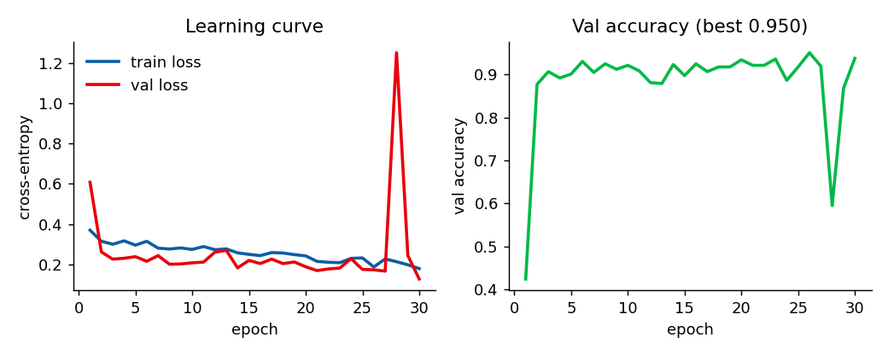

# LimonCELLo — DT neuron & cilia analysis


## Overview

LimonCELLo processes 3-D Imaris (`.ims`) microscopy datasets. It segments cilia,
basal bodies, neurites and nuclei, **pairs each cilium to its basal body**, and
classifies where each cilium sits — on a **neurite** or on the **soma** — from the
geometry of the surrounding structures. It ships three GUIs plus a batch pipeline
and a small CNN that learns to reject false-positive cilia.

Check out the [tutorial notebook](tutorial/tutorial.ipynb).

### Install

```powershell
git clone https://github.com/daggermaster3000/LimonCELLo.git
pip install numpy scipy pandas matplotlib pyclesperanto_prototype scikit-image apoc imaris_ims_file_reader seaborn tqdm skan stackview
# for the AI cilia validator (optional, GPU recommended):
pip install torch pillow
```

---

## The apps

| App | Launch | What it's for |
|-----|--------|---------------|
| **Pipeline** | `python napari_app.py` | Step through one image (load → segment → distances → classify), tune parameters live, then run the whole folder in **batch**. Also trains APOC segmenters. |
| **Annotator** | `python napari_annotator_app.py` | Draw bounding boxes around cilia on the XY MIP and tag each `neurite` / `soma` / `uncertain`. Exports an Excel of ground-truth boxes. |
| **Data app** | `streamlit run data_app.py` | Explore & compare finished runs: overlays, distributions, scatter, QC, hand/box validation, per-cilia screening, PDF report. |

---

## How the pipeline works

Each image runs through the following steps (interactively one at a time, or over
a whole folder in batch). All physical quantities use the anisotropic voxel size
`(vz, vy, vx)` in µm read from the `.ims` metadata.

1. **Load & normalise** — read the `.ims` stack `(C, Z, Y, X)`, per-channel
   percentile min–max normalisation. Optional **MIP** (2-D projection) or
   **make isotropic** (resample every axis to the coarsest spacing, usually Z).
   The isotropic result is cached on disk (keyed on file + load params) so
   re-running load after only changing a *segmentation* parameter is instant.

2. **Segment cilia** — APOC `ObjectSegmenter` (`.cl` classifier) on the raw cilia
   channel, size-gated (min/max voxels).

3. **Segment nuclei** — Voronoi–Otsu (tophat + spot/outline σ) **or** an APOC
   classifier (same UI layout as basal bodies).

4. **Segment neurites** — spot-sigma Voronoi labelling + skeletonisation.
   Optionally merge nuclei into the neurite channel before skeletonising.

5. **Segment basal bodies** — Voronoi–Otsu **or** an APOC classifier, size-gated.

6. **Distance maps** — EDT (µm) to nuclei and inside neurites, a regularised
   **ratio map** `(d_nuclei + ε)/(d_neurite + ε)` and its `log`, plus the
   distance to the nearest neurite and the nearest-skeleton-voxel index.

7. **Assign & classify** — per cilium / basal body, sample the distance features
   at its centroid; classify from `log_ratio` against the neurite / soma
   thresholds (`neurite` if `log_ratio > neurite_thr`, `soma` if `< soma_thr`,
   else `ambiguous`). Attach 3-D shape descriptors (volume, sphericity, length…).

8. **Pair cilia ↔ basal bodies** — see below. The cilium can inherit its paired
   basal body's ratio, then re-classify, so `class` reflects the basal-body
   position.

### Cilia ↔ basal-body pairing

Two modes:

* **Nearest (default)** — every (cilium, basal body) µm distance is sorted
  ascending and assigned greedily, **closest first, strict 1:1**. Pairs beyond
  `max BB dist (µm)` are rejected.

* **Axis-directed** (`Axis-directed BB pairing`) — a basal body sits at the
  *base* of a cilium, roughly on its long axis. For each cilium we take the
  **major axis** (PCA of its label voxels) and, seeding from each **extremity**,
  search a cone (half-angle `cone_angle_deg`, length `search_dist_um`) pointing
  outward along the axis. The nearest basal body inside the cone is the
  directional candidate; candidates are assigned closest-first, strict 1:1
  (`pairing_method = "axis"`). Any cilium with no axis hit **falls back** to the
  nearest-neighbour rule (`pairing_method = "nearest"`), so it never pairs fewer
  cilia than the default.

### Batch outputs

A batch writes `lc-analysis-*/` with `csv/all_cilia_features.xlsx` (per-object
table), `figures/napari_overlays/` (3-D screenshots), `figures/cilia_rois/`
(per-cilium RGB thumbnails + raw `.npz` crops), and `figures/mips/` (per-channel
XY MIP arrays). The **data app** reads these.

---

## Validation workflow (is the pipeline right?)

Two independent ground-truth routes, both in the data app:

* **Hand counts** — a per-sample Excel of manual counts → correlation, Bland–Altman,
  threshold optimiser (Validation tab).
* **Per-cilia boxes** — the **Annotator** app's box Excel. The data app matches
  each detected cilium (its centroid projected onto the XY MIP) to the hand-drawn
  boxes → **recall** (which cilia we miss), a **confusion matrix** (which we
  misclassify), and an interactive manual-vs-pipeline class plot (click a point →
  its ROI). Pipeline `ambiguous` is scored as equal to manual `uncertain`.

---

## The AI cilia validator (`cilialpha-3`)

A small CNN that learns, from human keep/reject screening decisions, to tell a
**real cilium ROI** from junk (out-of-focus blobs, debris, merged segments). It
**assists** manual review — it does not replace it. Code: `limoncello/ml/roi_validator.py`.

### Inputs

Each sample is one **per-cilium ROI thumbnail**, rendered from the raw crop:

* **RGB image**, `96 × 96` px (the `big` arch; `tiny` uses `64 × 64`).
* **Green channel** = cilia channel MIP, **magenta** (red+blue) = basal-body
  channel MIP. Neurite/nuclei are dropped so the net focuses on the cilium and
  its base.
* Each channel is scaled to its own dynamic range (`/255` for `cilialpha-3`; newer
  models can use a 1–99.8 percentile stretch — the choice is stored in the bundle
  and reused at inference).
* **Label** = the human decision: `1 = keep` (real cilium), `0 = reject`.

### Architecture (`ROINetBig`, ~1.21 M params)

```
Input 3 × 96 × 96
 ├─ Block1: [Conv3×3→BN→ReLU]×2 (32) → MaxPool2   → 32 × 48 × 48
 ├─ Block2: [Conv3×3→BN→ReLU]×2 (64) → MaxPool2   → 64 × 24 × 24
 ├─ Block3: [Conv3×3→BN→ReLU]×2 (128)→ MaxPool2   → 128 × 12 × 12
 ├─ Block4: [Conv3×3→BN→ReLU]×2 (256)→ MaxPool2   → 256 × 6 × 6
 └─ AdaptiveAvgPool → 256
Head: Dropout(0.4) → Linear(256→128) → ReLU → Dropout(0.3) → Linear(128→2)
```

(There is also a CPU-friendly `TinyROINet`, ~31 k params, for `64²` inputs.)

### How `cilialpha-3` was trained

* **Data**: 2 179 labelled ROIs — **519 keep / 1 660 reject** — split
  **1 634 train / 545 val** (75 / 25). Class-weighted loss counters the
  keep/reject imbalance.
* **Optimiser**: Adam, lr `1e-3`, weight decay `1e-4`, cross-entropy, batch 32,
  mixed precision on **CUDA**.
* **Augmentation** (label-preserving): random H/V flip + 90° rotation; per-sample
  brightness ±20 %, contrast ±20 %, log-uniform gamma (≈0.8–1.25), Gaussian noise
  (σ≈0.02). Photometric factors are shared across channels so the cilia/basal-body
  colour relationship is preserved.
* **Early stopping** on validation loss (patience 8), best checkpoint kept. Ran
  **30 epochs**.

**Learning curve** — val loss falls from 0.61 → 0.13, val accuracy 0.42 → **0.938**:



**Validation metrics** (best checkpoint, 545 val ROIs, threshold 0.5):

| metric | value |
|--------|-------|
| accuracy | **0.938** |
| ROC-AUC | **0.992** |
| recall (TPR) | 0.961 |
| precision | 0.809 |
| specificity | 0.930 |
| confusion (tp / tn / fp / fn) | 123 / 388 / 29 / 5 |


> The ROC marker is the measured operating point at threshold 0.5 and the printed
> AUC is measured; the drawn curve shape is illustrative (per-sample validation
> scores are not stored in the bundle). Lower the keep-threshold in the app to
> trade precision for recall.

### Using it

In the pipeline app (batch) or the data app's Screening tab: pick a `models/*.pt`
bundle, set the keep-threshold, and score ROIs. The data app also offers
**Grad-CAM** and activation maps to see what the net looks at. Bundles record
their architecture + input size, so older `tiny` models still load.
