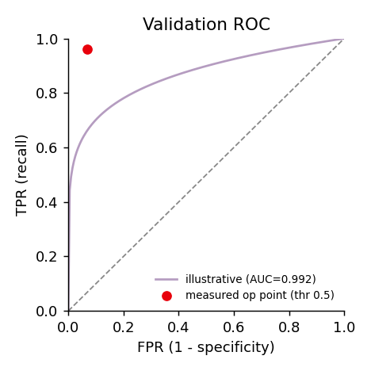

# AI cilia validator (`cilialpha-3`)

[← Home](Home.md)

A small CNN that learns, from human keep/reject decisions, to tell a **real cilium
ROI** from junk (out-of-focus blobs, debris, merged segments). It **assists**
manual review — it does not replace it.
Code: `limoncello/ml/roi_validator.py`.

---

## Inputs

Each sample is one **per-cilium ROI thumbnail**, rendered from the raw crop:

- **RGB image**, `96 × 96` px (the `big` arch; `tiny` uses `64 × 64`).
- **Green** = cilia-channel MIP, **magenta** (red+blue) = basal-body-channel MIP.
  Neurite/nuclei are dropped so the net focuses on the cilium and its base.
- Each channel is scaled to its own dynamic range (`/255` for `cilialpha-3`; newer
  models can use a 1–99.8 percentile stretch — the choice is stored in the bundle
  and reused at inference).
- **Label** = the human decision: `1 = keep`, `0 = reject`.

## Architecture (`ROINetBig`, ~1.21 M params)

```
Input 3 × 96 × 96
 ├─ Block1: [Conv3×3→BN→ReLU]×2 (32)  → MaxPool2 → 32 × 48 × 48
 ├─ Block2: [Conv3×3→BN→ReLU]×2 (64)  → MaxPool2 → 64 × 24 × 24
 ├─ Block3: [Conv3×3→BN→ReLU]×2 (128) → MaxPool2 → 128 × 12 × 12
 ├─ Block4: [Conv3×3→BN→ReLU]×2 (256) → MaxPool2 → 256 × 6 × 6
 └─ AdaptiveAvgPool → 256
Head: Dropout(0.4) → Linear(256→128) → ReLU → Dropout(0.3) → Linear(128→2)
```

There is also a CPU-friendly `TinyROINet` (~31 k params) for `64²` inputs. Bundles
record their architecture + input size, so older `tiny` models still load.

## How `cilialpha-3` was trained

- **Data:** 2 179 labelled ROIs (519 keep / 1 660 reject), split 1 634 train /
  545 val. Class-weighted loss counters the imbalance.
- **Optimiser:** Adam, lr `1e-3`, weight decay `1e-4`, cross-entropy, batch 32,
  mixed precision on CUDA.
- **Augmentation** (label-preserving): random H/V flip + 90° rotation; per-sample
  brightness/contrast ±20 %, log-uniform gamma (~0.8–1.25), Gaussian noise
  (σ≈0.02). Photometric factors are shared across channels.
- **Early stopping** on val loss (patience 8), best checkpoint kept, 30 epochs.

**Learning curve** — val loss 0.61 → 0.13, val accuracy 0.42 → **0.938**:


**Validation metrics** (best checkpoint, 545 val ROIs, threshold 0.5):

| metric | value |
|--------|-------|
| accuracy | **0.938** |
| ROC-AUC | **0.992** |
| recall (TPR) | 0.961 |
| precision | 0.809 |
| specificity | 0.930 |
| confusion (tp / tn / fp / fn) | 123 / 388 / 29 / 5 |



> The ROC marker is the measured operating point at threshold 0.5 and the printed
> AUC is measured; the drawn curve shape is illustrative. Lower the keep-threshold
> to trade precision for recall.

---

## Using it

**In batch** (Pipeline app): tick **AI-validate cilia during batch**, pick a
`models/*.pt` bundle and a keep-threshold. It writes `csv/human_validation.csv`
(`filename, cilia_id, human_validated, ai_score`) and per-sample ring overlays.

**In the Data app** (Screening tab): pick a model, set the threshold, score the
ROIs. The app shows keep/reject suggestions, flags the *unsure* ones for you, and
offers **Grad-CAM** / activation maps to see what the net looks at. Applying
suggestions only affects **undecided** cilia — your manual calls are preserved.

Pre-existing batch AI decisions load automatically — see
[Data app › Screening](06-Data-App.md#screening--ai-pre-validation).

---

**Next:** [Theory →](08-Theory.md)
