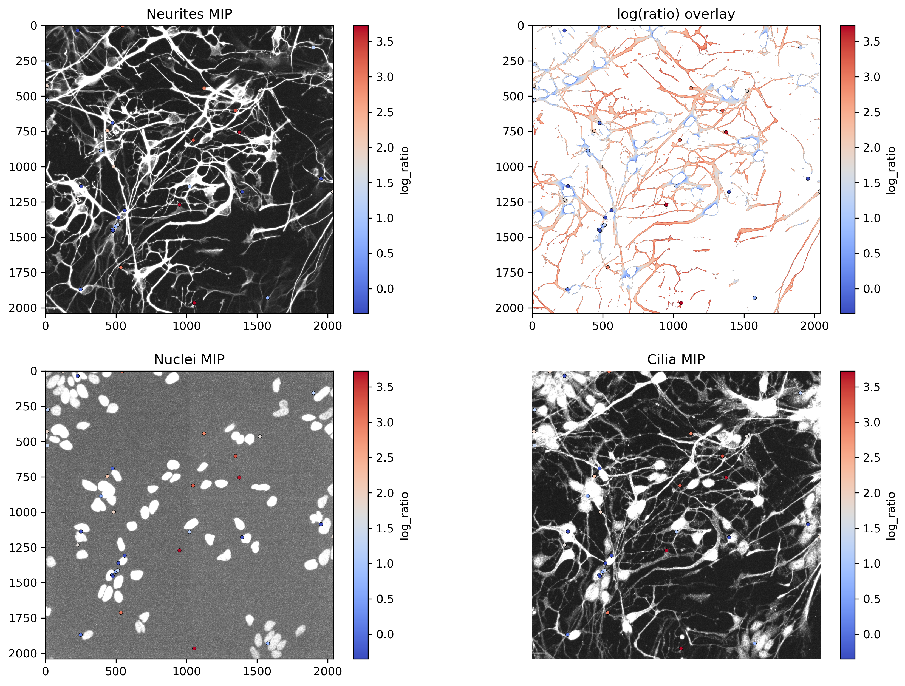

# LimonCELLo Wiki

```{toctree}
:hidden:
:maxdepth: 2

01-Installation
02-Quickstart
03-Pipeline-App
04-Batch-and-Super-Batch
05-Annotator-App
06-Data-App
07-AI-Cilia-Validator
08-Theory
09-Training-APOC
10-Troubleshooting
```

**LimonCELLo** processes 3-D Imaris (`.ims`) microscopy datasets. It segments cilia,
basal bodies, neurites and nuclei, **pairs each cilium to its basal body**, and
classifies where each cilium sits — on a **neurite** or on the **soma** — from the
geometry of the surrounding structures. It ships three GUIs, a batch pipeline, and
a small CNN that learns to reject false-positive cilia.



---

## Start here

| Page | What it covers |
|------|----------------|
| [Installation](01-Installation.md) | Environment setup (conda), dependencies, GPU. |
| [Quickstart](02-Quickstart.md) | From a folder of `.ims` to a results table in ~10 min. |

## The apps

| Page | App | Launch |
|------|-----|--------|
| [Pipeline app](03-Pipeline-App.md) | Step through one image, tune parameters live | `python napari_app.py` |
| [Batch & Super-batch](04-Batch-and-Super-Batch.md) | Process whole folders / whole folder-trees | (in the Pipeline app) |
| [Annotator app](05-Annotator-App.md) | Draw ground-truth cilia boxes | `python napari_annotator_app.py` |
| [Data app](06-Data-App.md) | Explore & compare finished runs | `streamlit run data_app.py` |
| [AI cilia validator](07-AI-Cilia-Validator.md) | CNN that rejects junk detections | (in batch / data app) |

## Understanding it

| Page | What it covers |
|------|----------------|
| [Theory](08-Theory.md) | Segmentation, distance/ratio maps, pairing, classification. |
| [Training APOC segmenters](09-Training-APOC.md) | Teach the tool to segment *your* images. |
| [Troubleshooting](10-Troubleshooting.md) | Install errors, GPU/VRAM, common pitfalls. |

---

## How the pipeline works (at a glance)

```
.ims  →  load & normalise  →  segment (cilia · nuclei · neurites · basal bodies)
      →  distance / ratio maps  →  assign features & classify  →  pair cilia↔BB
      →  per-object table + ROIs + overlays  →  Data app
```

Each cilium ends up labelled **neurite** / **soma** / **ambiguous** with a full set
of geometric features. See [Theory](08-Theory.md) for the maths.

---

### About this wiki

These pages are authored in Markdown under `docs/` (versioned with the code) and
build into a Sphinx site via MyST. Screenshots go in `docs/images/` — see that
folder's `README.md` for the filename convention. Build the site with:

```console
pip install -r docs/requirements.txt
cd docs && make html      # or: make.bat html   (Windows)
```

The result is in `docs/_build/html/`. The same `.md` files also render directly on
GitHub, so the wiki is readable without building.
